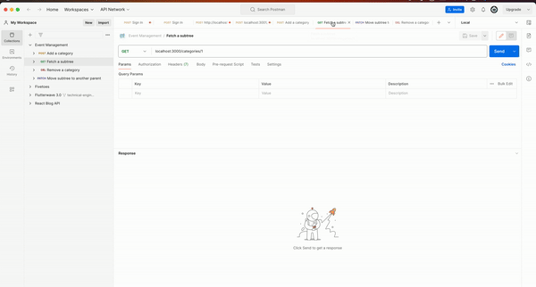

## Event Management Application

* [Requirements](#Requirements)
* [Installation](#Installation)
* [Architecture](#Architecture)

## Requirements
Ensure you have the following installed
1. NodeJS version 20x preferrably
2. Typescript
3. PostgreSQL 

## Installation
###### Clone the repo
```
git clone https://github.com/bc2mighty/event-management.git
```
###### Navigate to the root of the project and install all npm packages with the command below:
```
npm i
```
###### Copy the env file and fill the env variables with your Postgres database configuration
```
cp env.example .env
```
###### Start the application with the following command:
```
npm run start:dev
```
Download a sample postman collection to make calls to the REST APIs provided in this project here [Postman Doc](Event_Management.postman_collection.json). Import this collection into your Postman Desktop Application and ensure you replace the root URL in the postman requests with the URL that the application is running on. There are postman examples with sample responses in each request. Below is a description of the postman API calls also:


## Architecture
1. Database Schema

The project uses label tree (also known as ltree) database structure which is faster than Recursive Common Table Expression (CTE) and Static Tree Schema. The documentation for this can be found here <a  target="_blank" href="https://www.postgresql.org/docs/9.1/ltree.html">Postgres ltree</a>. This technique reduces the complexity of tree traversal queries to simple wildcard sort of expressions like `Label1` to match the root of the tree, `Label1.*` to match descendants of `Label1`, and `*.Label1.*` to match both ancestors and descendants of `Label1`
The Table and ltree extensions are created as soon as the application starts running.

2. Architecture

The project partially uses an MVC architecture, even though no model is created. No model is created because Sequelize ORM does not have a way to use a ltree extension type for it's columns when creating a model. The only way is to create an ltree extension use a raw query, hence why the model is represented by raw queries in the db folder.
The project is fully written in typescript and uses PostgreSQL database.
Furthermore, there is a validation layer for every request to ensure that the right data is passed to the application.